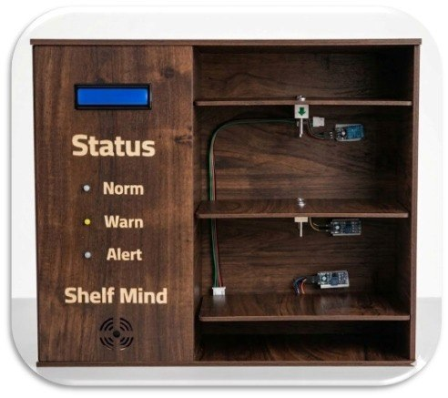
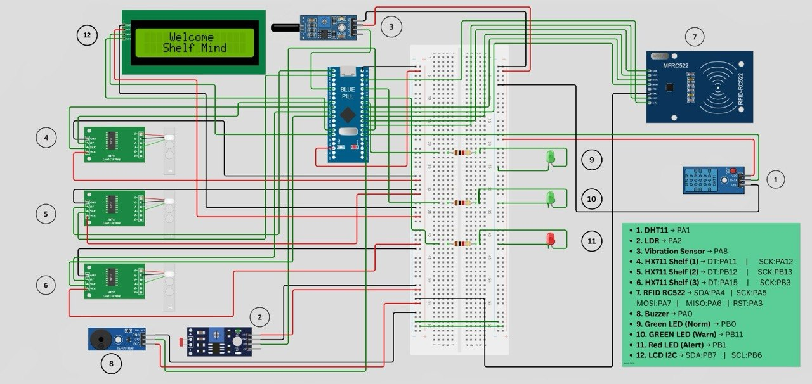

# Shelf Mind — Smart Warehouse Monitoring System

An STM32-based smart warehouse monitoring system that tracks product weight, environmental conditions, and shelf identity in real time — reducing manual inventory checks and preventing damage to sensitive products (medicines, vitamins, skincare).

## Problem
Sensitive products such as medicines, vitamins, and skincare can be damaged by high temperature, humidity, sunlight, or vibration, affecting their quality and safety. Traditional warehouses rely on manual monitoring, which leads to human errors and delayed problem detection.

## Solution
A smart system using **STM32 (Blue Pill)** as the main controller that:
- Measures product quantity using load cells (HX711)
- Monitors temperature & humidity (DHT11)
- Detects sunlight exposure (LDR)
- Detects vibration/shock (vibration sensor)
- Identifies shelves via RFID (RC522)
- Displays live data on a 16x2 I2C LCD
- Alerts via LEDs and buzzer

---

## Prototype

### Final Device

### Wiring Diagram

---

## Hardware
| Component | STM32 Pin | Function |
|---|---|---|
| DHT11 | PA1 | Temperature & Humidity |
| LDR | PA2 | Light detection |
| Vibration Sensor | PA8 | Shock / movement detection |
| HX711 Shelf 1 | DT:PA11, SCK:PA12 | Weight measurement |
| HX711 Shelf 2 | DT:PB12, SCK:PB13 | Weight measurement |
| HX711 Shelf 3 | DT:PA15, SCK:PB3 | Weight measurement |
| RFID RC522 | SDA:PA4, SCK:PA5, MOSI:PA7, MISO:PA6, RST:PA3 | Shelf identification |
| Buzzer | PA0 | Alert |
| Green LED (Normal) | PB0 | Status indicator |
| Yellow LED (Warning) | PB11 | Status indicator |
| Red LED (Alert) | PB1 | Status indicator |
| LCD I2C 16x2 | SDA:PB7, SCL:PB6 | Display |

## How It Works
1. System initializes all sensors and calibrates the three load cells.
2. RFID card is scanned → identifies the shelf → displays product info.
3. Load cell reads weight → LED color indicates stock level (Green / Yellow / Red).
4. Sensors continuously monitor temperature, humidity, light, and vibration.
5. If any condition goes out of range → buzzer + warning message on the LCD.

## Files
- `shelf_mind.ino` — Main STM32 firmware
- `Shelf_Mind_Presentation.pdf` — Project presentation
- `Shelf_Mind_Prototype.jpg` — Final prototype photo
- `Shelf_Mind_Wiring.jpg` — Full wiring diagram

## Team
- Menna Tarek Elfar
- Nada Yousry Ibrahim
- Shahd Mohammed Hatab
- Nourhan Mahmoud Elsherbiny
- Hager Mohammed Elazazy
- **Haneen Adel Attia — Hardware Setup & Testing**

**Supervisor:** Dr. Tamer Cmara

## My Contribution
Contributed as part of a 6-member team throughout the hardware setup and testing phases, including:
- Assisting in wiring and connecting sensors to the STM32
- Supporting module testing before full-system integration
- Participating in assembling and validating the final prototype

## Future Work
- IoT cloud system for remote monitoring
- Mobile application dashboard
- Database for analytics
- AI-based prediction for product spoilage
- Scalability to more shelves
